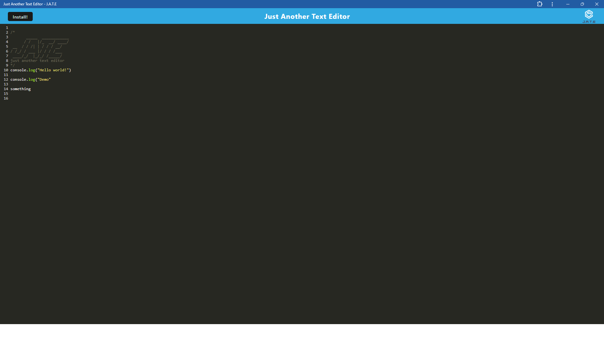

# PWA Text Editor

## Description
PWA Text Editor is a Progressive Web Application (PWA) that allows users to create and edit text notes with JavaScript syntax highlighting. This application can be installed on various devices and works offline, providing a seamless and responsive user experience. The project leverages modern web technologies like Workbox for service workers, IndexedDB for offline storage, and Webpack for module bundling.

## Table of Contents
- [PWA Text Editor](#pwa-text-editor)
  - [Description](#description)
  - [Table of Contents](#table-of-contents)
  - [Installation](#installation)
  - [Usage](#usage)
  - [Features](#features)
  - [Screenshots](#screenshots)
  - [Contributing](#contributing)
  - [License](#license)
  - [Questions](#questions)

## Installation
To run the application locally, follow these steps:

1. Clone the repository:
```bash
git clone https://github.com/Mpierson00/PWA-text-editor.git
cd PWA-text-editor
```

2. Install dependencies:
```bash
npm install
cd client
npm install
```

3. Build the application:
```bash
npm run build
```

4. Start the server:
```bash
npm start
```

5. Open your browser and navigate to http://localhost:3000.

## Usage
Open the Application:
- Navigate to http://localhost:3000 in your web browser.

Create and Edit Notes:
- Use the text editor to create and edit your notes. The editor supports JavaScript syntax highlighting.

Install the PWA:
- Click the "Install" button to add the application to your desktop or mobile device for a native app-like experience.

Work Offline:
- The application works offline, allowing you to continue creating and editing notes without an internet connection.

## Features
- Installable: Can be installed as a PWA on various devices.
- Offline Functionality: Works offline using service workers and IndexedDB.
- JavaScript Syntax Highlighting: Provides syntax highlighting for JavaScript code.
- Responsive Design: Adapts to various screen sizes and devices.
- Data Persistence: Saves notes using IndexedDB for offline access.

## Screenshots



## Contributing
Contributions are welcome! Please fork the repository and create a pull request with your changes. Ensure that your code adheres to the project's coding standards and includes appropriate documentation.

1. Fork the Project.
2. Create your Feature Branch (`git checkout -b feature/AmazingFeature`).
3. Commit your Changes (`git commit -m 'Add some AmazingFeature'`).
4. Push to the Branch (`git push origin feature/AmazingFeature`).
5. Open a Pull Request.

## License
This project is licensed under the MIT License. See the LICENSE file for details.

## Questions
For any questions or inquiries, please open an issue in the repository or contact me via email:

- GitHub: [Mpierson00](https://github.com/Mpierson00)
- Live Application: [PWA Text Editor](https://pwa-text-editor-m1eh.onrender.com)

